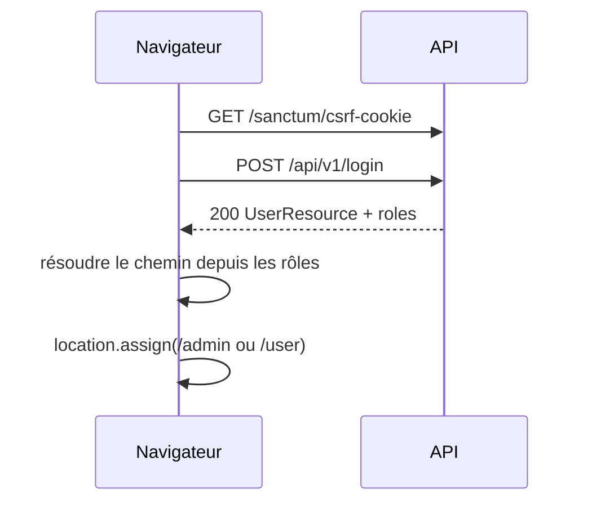

# Zones admin vs étudiant — guide pas à pas

> **Version anglaise :** [ADMIN_AND_STUDENT_AREAS_GUIDE.md](./ADMIN_AND_STUDENT_AREAS_GUIDE.md)  
> **Guide complet (permissions, rôles incl. `instructor` / `super_admin`, auth, redirections) :** [IDENTITE_ACCES_PERMISSIONS_ROLES_AUTH.fr.md](./IDENTITE_ACCES_PERMISSIONS_ROLES_AUTH.fr.md)

Ce guide explique comment séparer l’application en **deux espaces authentifiés** (back-office administrateur vs espace apprenant/étudiant), comment doit fonctionner la **redirection après connexion**, et où chaque brique s’intègre dans la structure **actuelle** du backend `laravel-webkin`.

Il est rédigé par rapport au code que vous avez aujourd’hui :

| Élément | Emplacement |
|--------|-------------|
| Table `roles` + pivot | `database/migrations/2026_03_28_161055_create_roles_table.php`, `..._create_user_roles_table.php` |
| Seeder de rôles (seulement `student` aujourd’hui) | `database/seeders/RoleSeeder.php` |
| L’inscription assigne `student` | `app/Application/IdentityAccess/Actions/RegisterUserAction.php` |
| API de connexion par session | `POST /api/v1/login` → `LoginUserAction` (charge `roles`) |
| Tableaux de bord Blade locaux | `routes/web.php` → `/user`, `/admin` |
| Page de test de connexion (redirige toujours vers `/user`) | `resources/views/auth/login.blade.php` |

---

## 1. Définir le modèle de rôles

### 1.1 Slugs recommandés

Utilisez des **slugs en base** (pas `UserStatus`) pour répondre à « que peut faire cette personne ? » :

| Slug | Zone | Qui le reçoit |
|------|------|----------------|
| `student` | Apprenant (`/user` ou `/student`) | Auto-inscription, par défaut |
| `admin` | Back-office (`/admin`) | Créé par le staff / seeder |
| `editor` | Back-office (`/admin`) | Équipe contenu |
| `super-admin` | Back-office (`/admin`) | Contrôle total de la plateforme |

`UserStatus` (`active`, `suspended`, …) reste sur la table `users` et répond à « le compte peut-il se connecter ? » — pas à « quelle interface voit-il ? ».

### 1.2 Un utilisateur, plusieurs rôles possibles

Votre schéma supporte déjà le many-to-many (`user_roles`). Pour la redirection, définissez une **règle de priorité**, par exemple :

1. Si l’utilisateur a un rôle **staff** (`admin`, `editor`, `super-admin`) → envoyer vers l’accueil **admin**.
2. Sinon, s’il a `student` → envoyer vers l’accueil **étudiant**.
3. Sinon → traiter comme non autorisé (ou une page « aucun rôle assigné »).

Documentez cette règle à un seul endroit (voir l’étape 4).

---

## 2. Peupler les rôles en base

**Étape 2.1** — Étendre `database/seeders/RoleSeeder.php` pour que tous les slugs existent avant inscription/connexion :

```php
$roles = [
    ['slug' => 'student',      'name' => 'Student',      'description' => 'Learner (default signup).'],
    ['slug' => 'admin',       'name' => 'Admin',        'description' => 'Back-office administrator.'],
    ['slug' => 'editor',      'name' => 'Editor',       'description' => 'Content editor.'],
    ['slug' => 'super-admin', 'name' => 'Super Admin',  'description' => 'Full platform access.'],
];

foreach ($roles as $role) {
    Role::query()->firstOrCreate(['slug' => $role['slug']], $role);
}
```

**Étape 2.2** — Exécuter :

```bash
cd backend
php artisan db:seed --class=RoleSeeder
```

**Étape 2.3** — Assigner les rôles staff manuellement pour les tests locaux (exemple Tinker) :

```php
$user = \App\Models\User::where('email', 'admin@example.com')->first();
$admin = \App\Models\Role::where('slug', 'admin')->first();
$user->roles()->syncWithoutDetaching([$admin->id]);
```

Ne jamais exposer `role_ids` sur le `POST /api/v1/register` public (votre `RegisterUserRequest` interdit déjà d’élever `status` ; faites de même pour les rôles).

---

## 3. Ajouter l’enum `RoleSlug` (source unique de vérité)

**Étape 3.1** — Créer `app/Domain/IdentityAccess/Enums/RoleSlug.php` :

```php
<?php

namespace App\Domain\IdentityAccess\Enums;

enum RoleSlug: string
{
    case Student = 'student';
    case Admin = 'admin';
    case Editor = 'editor';
    case SuperAdmin = 'super-admin';

    /** Rôles autorisés à accéder à la zone administrateur. */
    public static function staffSlugs(): array
    {
        return [
            self::Admin->value,
            self::Editor->value,
            self::SuperAdmin->value,
        ];
    }

    public static function studentSlugs(): array
    {
        return [self::Student->value];
    }
}
```

**Étape 3.2** — Remplacer les chaînes magiques dans les actions :

- `RegisterUserAction::DEFAULT_STUDENT_ROLE_SLUG` → `RoleSlug::Student->value`
- `CreateUserAction` — idem

Cela aligne inscription, seeders, middleware et redirections.

---

## 4. Ajouter des helpers de rôles sur `User`

**Étape 4.1** — Sur `app/Models/User.php`, ajouter :

```php
use App\Domain\IdentityAccess\Enums\RoleSlug;

public function hasRole(RoleSlug|string $role): bool
{
    $slug = $role instanceof RoleSlug ? $role->value : $role;

    if ($this->relationLoaded('roles')) {
        return $this->roles->contains('slug', $slug);
    }

    return $this->roles()->where('slug', $slug)->exists();
}

public function hasAnyRole(array $roles): bool
{
    foreach ($roles as $role) {
        if ($this->hasRole($role)) {
            return true;
        }
    }

    return false;
}

public function isStaff(): bool
{
    return $this->hasAnyRole(RoleSlug::staffSlugs());
}

public function isStudent(): bool
{
    return $this->hasRole(RoleSlug::Student);
}
```

**Étape 4.2** — Centraliser les chemins post-connexion dans un service (recommandé) :

Créer `app/Domain/IdentityAccess/Services/PostLoginRedirectResolver.php` :

```php
<?php

namespace App\Domain\IdentityAccess\Services;

use App\Models\User;
use Symfony\Component\HttpKernel\Exception\HttpException;

final class PostLoginRedirectResolver
{
    public const STUDENT_HOME = '/user';   // ou '/student' si vous renommez les routes
    public const ADMIN_HOME = '/admin';

    public function pathFor(User $user): string
    {
        if ($user->isStaff()) {
            return self::ADMIN_HOME;
        }

        if ($user->isStudent()) {
            return self::STUDENT_HOME;
        }

        throw new HttpException(403, 'No dashboard role assigned.');
    }
}
```

L’enregistrer dans `app/Providers/DomainServiceProvider.php` si vous utilisez des interfaces ailleurs.

**Pourquoi un resolver ?** La même règle est utilisée depuis :

- le JavaScript de connexion Blade ;
- un futur routeur Vue ;
- une route web optionnelle `GET /dashboard` ;
- les tests.

---

## 5. Protéger chaque zone avec un middleware

Aujourd’hui `/user` et `/admin` n’utilisent que `middleware('auth')` — **tout utilisateur connecté peut ouvrir les deux**. Corrigez cela avec un middleware de rôles.

### 5.1 Créer le middleware

`app/Http/Middleware/EnsureUserHasRole.php` :

```php
<?php

namespace App\Http\Middleware;

use Closure;
use Illuminate\Http\Request;
use Symfony\Component\HttpFoundation\Response;

final class EnsureUserHasRole
{
    /**
     * @param  \Closure(Request): Response  $next
     * @param  string  ...$roles  Slugs de rôles, ex. admin,editor,super-admin
     */
    public function handle(Request $request, Closure $next, string ...$roles): Response
    {
        $user = $request->user();

        if ($user === null || ! $user->hasAnyRole($roles)) {
            abort(403);
        }

        return $next($request);
    }
}
```

Optionnel : en cas de 403, rediriger le staff hors de `/user` et les étudiants hors de `/admin` via `PostLoginRedirectResolver` au lieu d’une page 403 brute.

### 5.2 Enregistrer l’alias (Laravel 11)

Dans `bootstrap/app.php`, dans `withMiddleware` :

```php
$middleware->alias([
    'role' => \App\Http\Middleware\EnsureUserHasRole::class,
]);
```

### 5.3 Mettre à jour `routes/web.php`

Structure d’exemple (routes locales de dev que vous avez déjà) :

```php
Route::middleware('auth')->group(function (): void {
    Route::middleware('role:student')
        ->prefix('user') // préfixe optionnel ; ou garder Route::view('/user', ...)
        ->group(function (): void {
            Route::view('/', 'user.index')->name('user.dashboard');
            // futur : Route::view('/courses', 'user.courses')...
        });

    Route::middleware('role:admin,editor,super-admin')
        ->prefix('admin')
        ->group(function (): void {
            Route::view('/', 'admin.index')->name('admin.dashboard');
            // futurs modules admin...
        });
});
```

Conserver les noms de routes `user.dashboard` et `admin.dashboard` pour que `auth-menu` continue de fonctionner.

### 5.4 Routes API admin (plus tard)

Reproduire la même idée sous `routes/api.php` :

```php
Route::middleware(['auth:sanctum', 'role:admin,editor,super-admin'])
    ->prefix('v1/admin')
    ->group(function () {
        // ListUsersController, etc.
    });

Route::middleware(['auth:sanctum', 'role:student'])
    ->prefix('v1/student')
    ->group(function () {
        // inscriptions, devoirs...
    });
```

Session (SPA) et Bearer (Postman) passent tous deux `auth:sanctum` une fois l’utilisateur authentifié.

---

## 6. Redirection après connexion — trois modèles

Votre connexion renvoie déjà du JSON avec les rôles lorsque `LoginUserAction` exécute `$user->load('roles')`.

```json
{
  "data": {
    "email": "...",
    "roles": [{ "slug": "admin", "name": "Admin", ... }]
  }
}
```

Choisissez **un modèle principal** par type de client.

### Modèle A — Redirection côté client (Blade actuel / Vue future)

**Adapté à :** `resources/views/auth/login.blade.php`, SPA Vite avec `POST /api/v1/login`.

**Flux :**



**Étape 6A.1** — Après une connexion réussie, analyser les rôles et rediriger :

```javascript
const STUDENT_HOME = '/user';
const ADMIN_HOME = '/admin';
const STAFF_SLUGS = ['admin', 'editor', 'super-admin'];

function dashboardPathFromLoginPayload(json) {
    const roles = json?.data?.roles ?? [];
    const slugs = roles.map((r) => r.slug);
    if (slugs.some((s) => STAFF_SLUGS.includes(s))) return ADMIN_HOME;
    if (slugs.includes('student')) return STUDENT_HOME;
    return null;
}

// dans le gestionnaire submit, quand res.ok :
const json = JSON.parse(text);
const path = dashboardPathFromLoginPayload(json);
if (path) {
    window.location.assign(path);
} else {
    out.textContent = 'Connecté mais aucun rôle de tableau de bord assigné.';
}
```

**Étape 6A.2** — Mettre à jour le texte d’aide dans `login.blade.php` (aujourd’hui il indique toujours « envoyé vers `/user` »).

**Équivalent Vue :** après connexion, `router.push(resolver.pathFor(user))` avec les mêmes listes de slugs.

---

### Modèle B — Redirection serveur (formulaire HTML classique)

**Adapté à :** formulaire HTML traditionnel `POST /login` (pas JSON).

Ajouter un contrôleur web léger, ex. `App\Http\Controllers\Auth\WebLoginController`, qui :

1. Valide email/mot de passe ;
2. Appelle `LoginUserAction` ;
3. `return redirect()->to(app(PostLoginRedirectResolver::class)->pathFor($user));`

Garder `POST /api/v1/login` pour SPA/JS ; n’utiliser la connexion web que si vous ajoutez un formulaire sans JS plus tard.

---

### Modèle C — URL d’entrée unique `/dashboard`

**Adapté à :** favoris et boutons « Connexion » qui ne doivent pas deviner la zone.

```php
// routes/web.php
Route::get('/dashboard', function (Request $request, PostLoginRedirectResolver $resolver) {
    return redirect()->to($resolver->pathFor($request->user()));
})->middleware('auth')->name('dashboard');
```

Ensuite :

- Succès de connexion invité → rediriger vers `route('dashboard')` au lieu de `/user` en dur.
- Lien « Accueil » dans `auth-menu` → `route('dashboard')`.

---

### Quel modèle utiliser quand

| Client | Point de terminaison de connexion | Redirection |
|--------|-----------------------------------|-------------|
| Pages de test Blade (`/login`) | `POST /api/v1/login` + cookies | **Modèle A** ou **C** |
| SPA Vue (plus tard) | Idem + CSRF | **Modèle A** + garde de route sur `/admin/*` |
| Postman / mobile | `POST /api/v1/access-token` | Pas de redirection web ; le client chooit l’écran via `user.roles` |
| Formulaire HTML classique (optionnel) | Web `POST /login` | **Modèle B** |

---

## 7. Rediriger si déjà connecté (routes invité)

Si un étudiant visite `/login` alors qu’il est authentifié, l’envoyer vers son accueil au lieu de réafficher le formulaire.

**Étape 7.1** — Créer le middleware `RedirectIfAuthenticatedToDashboard` (ou utiliser `guest` de Laravel + redirection personnalisée).

**Étape 7.2** — L’appliquer à `/login` et `/register` dans `web.php` :

```php
Route::middleware('guest')->group(function () {
    Route::view('/login', 'auth.login')->name('login');
    // register...
});
```

Dans le middleware, si `auth()->check()`, `redirect()->to($resolver->pathFor(auth()->user()))`.

Configurer `bootstrap/app.php` pour que `guest` redirige correctement (Laravel 11 : personnalisation de `RedirectIfAuthenticated` via le middleware `Authenticate` ou un middleware invité personnalisé).

---

## 8. Bloquer l’accès croisé entre zones (défense en profondeur)

Même avec une bonne redirection à la connexion, les utilisateurs peuvent saisir les URL à la main.

| Requête | Middleware | En cas d’échec |
|---------|------------|----------------|
| `GET /admin` | `auth` + `role:admin,editor,super-admin` | 403 ou redirection vers `PostLoginRedirectResolver::pathFor()` |
| `GET /user` | `auth` + `role:student` | 403 ou redirection |

Message convivial optionnel dans un `403.blade.php` partagé : « Vous n’avez pas accès à cette zone. »

Mettre à jour `resources/views/components/auth-menu.blade.php` pour **masquer** les liens inutilisables :

```blade
@auth
    @if (auth()->user()->isStudent())
        <a href="{{ route('user.dashboard') }}">Étudiant</a>
    @endif
    @if (auth()->user()->isStaff())
        <a href="{{ route('admin.dashboard') }}">Admin</a>
    @endif
@endauth
```

---

## 9. Optionnel : exposer l’indice de redirection dans l’API

Pour les SPA qui préfèrent un seul aller-retour :

**Étape 9.1** — Ajouter à `UserResource` lorsque l’utilisateur est authentifié :

```php
'dashboard_path' => app(PostLoginRedirectResolver::class)->pathFor($this->resource),
```

Ne l’inclure que lorsque `roles` est chargé et que l’appelant est autorisé à le voir.

**Étape 9.2** — `GET /api/v1/me` indique alors où envoyer l’utilisateur après un rafraîchissement.

---

## 10. Liste de contrôle d’implémentation (l’ordre compte)

| # | Tâche | Fichiers |
|---|--------|----------|
| 1 | Peupler `student`, `admin`, `editor`, `super-admin` | `RoleSeeder.php` |
| 2 | Ajouter l’enum `RoleSlug` | `app/Domain/IdentityAccess/Enums/RoleSlug.php` |
| 3 | Ajouter `hasRole` / `isStaff` / `isStudent` sur `User` | `app/Models/User.php` |
| 4 | Ajouter `PostLoginRedirectResolver` | `app/Domain/IdentityAccess/Services/...` |
| 5 | Créer le middleware `EnsureUserHasRole` + alias | `app/Http/Middleware/...`, `bootstrap/app.php` |
| 6 | Séparer les groupes de routes dans `web.php` avec le middleware `role:` | `routes/web.php` |
| 7 | Corriger la redirection de connexion (modèle A ou C) | `resources/views/auth/login.blade.php` |
| 8 | Masquer les liens du menu selon le rôle | `auth-menu.blade.php` |
| 9 | Assigner des utilisateurs de test via seeder ou Tinker | `DatabaseSeeder` / docs |
| 10 | Tests Pest : étudiant → `/user`, admin → `/admin`, accès croisé 403 | `tests/Feature/IdentityAccess/` |

---

## 11. Scénarios de test

1. **Un étudiant s’inscrit** → n’a que `student` → connexion → arrive sur `/user` → `/admin` renvoie 403.
2. **Utilisateur admin** (rôle synchronisé dans Tinker) → connexion → arrive sur `/admin` → `/user` renvoie 403 (si vous restreignez les routes étudiant à `student` uniquement).
3. **Utilisateur avec `student` et `admin`** → le resolver envoie vers `/admin` (le staff l’emporte).
4. **Utilisateur sans rôle** → la connexion renvoie 200 mais la redirection affiche une erreur / 403 sur `/dashboard`.
5. **API** → `GET /api/v1/me` inclut `roles` ; l’API réservée aux admin renvoie 403 pour les étudiants.

Exemple d’esquisse Pest :

```php
it('redirects staff to admin home', function () {
    $user = User::factory()->create([...]);
    $user->roles()->attach(Role::where('slug', 'admin')->first());

    $this->actingAs($user)
        ->get('/dashboard')
        ->assertRedirect('/admin');
});
```

---

## 12. Futur frontend Vue (mêmes règles)

1. **Modules de routeur :** `src/student/...` et `src/admin/...` (ou meta de route `{ requiresRole: 'admin' }`).
2. **Garde de navigation :** après `GET /api/v1/me`, si la route exige le staff et `!isStaff`, `router.push('/user')`.
3. **Connexion :** utiliser le modèle A avec `dashboard_path` depuis l’API si vous ajoutez l’étape 9.
4. **Ne pas** stocker le rôle dans `localStorage` comme frontière de sécurité — toujours faire confiance au middleware serveur ; les vérifications client ne servent qu’à l’UX.

---

## 13. Synthèse

| Sujet | Approche dans ce projet |
|-------|-------------------------|
| Définir admin vs étudiant | Lignes dans `roles` + pivot `user_roles` |
| Nouveaux utilisateurs par défaut | `student` uniquement (`RegisterUserAction`) |
| Interfaces séparées | `/admin` vs `/user` (Blade local aujourd’hui ; modules Vue plus tard) |
| Qui peut ouvrir quelle URL | Middleware `role:` sur les groupes de routes |
| Après connexion | Résoudre le chemin depuis les rôles (`PostLoginRedirectResolver`) ; la SPA utilise le JSON de `POST /api/v1/login`, ou `GET /dashboard` pour une redirection serveur |
| Clients API stateless | Pas de redirection HTTP ; lire `roles` depuis la réponse token / `GET /me` |

L’infrastructure est déjà en place ; ce guide ajoute le **peuplement**, les **enums/helpers**, le **middleware** et **une politique de redirection** pour que les administrateurs et les étudiants arrivent dans la bonne section et ne puissent pas parcourir la zone de l’autre par la seule URL.
