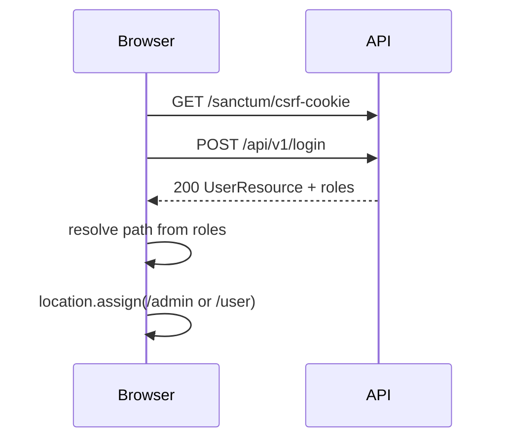

# Admin vs student areas — step-by-step guide

> **French version:** [ADMIN_AND_STUDENT_AREAS_GUIDE.fr.md](./ADMIN_AND_STUDENT_AREAS_GUIDE.fr.md)

This guide explains how to split the application into **two authenticated areas** (administrator back-office vs student/learner space), how **post-login redirection** should work, and where each piece fits in the **current** `laravel-webkin` backend structure.

It is written against the code you have today:

| Piece | Location |
|--------|-----------|
| Roles table + pivot | `database/migrations/2026_03_28_161055_create_roles_table.php`, `..._create_user_roles_table.php` |
| Role seeder (only `student` today) | `database/seeders/RoleSeeder.php` |
| Register assigns `student` | `app/Application/IdentityAccess/Actions/RegisterUserAction.php` |
| Session login API | `POST /api/v1/login` → `LoginUserAction` (loads `roles`) |
| Local Blade dashboards | `routes/web.php` → `/user`, `/admin` |
| Login test page (always redirects to `/user`) | `resources/views/auth/login.blade.php` |

---

## 1. Decide the role model

### 1.1 Recommended slugs

Use **database slugs** (not `UserStatus`) for “what can this person do?”:

| Slug | Area | Who gets it |
|------|------|-------------|
| `student` | Learner (`/user` or `/student`) | Self-registration, default |
| `admin` | Back-office (`/admin`) | Created by staff / seeder |
| `editor` | Back-office (`/admin`) | Content staff |
| `super-admin` | Back-office (`/admin`) | Full platform control |

`UserStatus` (`active`, `suspended`, …) stays on the `users` table and answers “is the account allowed to sign in?” — not “which UI do they see?”.

### 1.2 One user, possibly multiple roles

Your schema already supports many-to-many (`user_roles`). For redirection, define a **priority rule**, for example:

1. If the user has any **staff** role (`admin`, `editor`, `super-admin`) → send to **admin** home.
2. Else if they have `student` → send to **student** home.
3. Else → treat as unauthorized (or a “no role assigned” page).

Document this rule in one place (see step 4).

---

## 2. Seed roles in the database

**Step 2.1** — Extend `database/seeders/RoleSeeder.php` so all slugs exist before register/login:

```php
$roles = [
    ['slug' => 'student',      'name' => 'Student',      'description' => 'Learner (default signup).'],
    ['slug' => 'admin',       'name' => 'Admin',        'description' => 'Back-office administrator.'],
    ['slug' => 'editor',      'name' => 'Editor',       'description' => 'Content editor.'],
    ['slug' => 'super-admin', 'name' => 'Super Admin',  'description' => 'Full platform access.'],
];

foreach ($roles as $role) {
    Role::query()->firstOrCreate(['slug' => $role['slug']], $role);
}
```

**Step 2.2** — Run:

```bash
cd backend
php artisan db:seed --class=RoleSeeder
```

**Step 2.3** — Assign staff roles manually for local testing (Tinker example):

```php
$user = \App\Models\User::where('email', 'admin@example.com')->first();
$admin = \App\Models\Role::where('slug', 'admin')->first();
$user->roles()->syncWithoutDetaching([$admin->id]);
```

Never expose `role_ids` on public `POST /api/v1/register` (your `RegisterUserRequest` already prohibits elevating `status`; do the same for roles).

---

## 3. Add a `RoleSlug` enum (single source of truth)

**Step 3.1** — Create `app/Domain/IdentityAccess/Enums/RoleSlug.php`:

```php
<?php

namespace App\Domain\IdentityAccess\Enums;

enum RoleSlug: string
{
    case Student = 'student';
    case Admin = 'admin';
    case Editor = 'editor';
    case SuperAdmin = 'super-admin';

    /** Roles that may access the administrator area. */
    public static function staffSlugs(): array
    {
        return [
            self::Admin->value,
            self::Editor->value,
            self::SuperAdmin->value,
        ];
    }

    public static function studentSlugs(): array
    {
        return [self::Student->value];
    }
}
```

**Step 3.2** — Replace magic strings in actions:

- `RegisterUserAction::DEFAULT_STUDENT_ROLE_SLUG` → `RoleSlug::Student->value`
- `CreateUserAction` — same

This keeps registration, seeders, middleware, and redirects aligned.

---

## 4. Add role helpers on `User`

**Step 4.1** — On `app/Models/User.php`, add:

```php
use App\Domain\IdentityAccess\Enums\RoleSlug;

public function hasRole(RoleSlug|string $role): bool
{
    $slug = $role instanceof RoleSlug ? $role->value : $role;

    if ($this->relationLoaded('roles')) {
        return $this->roles->contains('slug', $slug);
    }

    return $this->roles()->where('slug', $slug)->exists();
}

public function hasAnyRole(array $roles): bool
{
    foreach ($roles as $role) {
        if ($this->hasRole($role)) {
            return true;
        }
    }

    return false;
}

public function isStaff(): bool
{
    return $this->hasAnyRole(RoleSlug::staffSlugs());
}

public function isStudent(): bool
{
    return $this->hasRole(RoleSlug::Student);
}
```

**Step 4.2** — Centralize post-login paths in one service (recommended):

Create `app/Domain/IdentityAccess/Services/PostLoginRedirectResolver.php`:

```php
<?php

namespace App\Domain\IdentityAccess\Services;

use App\Models\User;
use Symfony\Component\HttpKernel\Exception\HttpException;

final class PostLoginRedirectResolver
{
    public const STUDENT_HOME = '/user';   // or '/student' if you rename routes
    public const ADMIN_HOME = '/admin';

    public function pathFor(User $user): string
    {
        if ($user->isStaff()) {
            return self::ADMIN_HOME;
        }

        if ($user->isStudent()) {
            return self::STUDENT_HOME;
        }

        throw new HttpException(403, 'No dashboard role assigned.');
    }
}
```

Bind it in `app/Providers/DomainServiceProvider.php` if you use interfaces elsewhere.

**Why a resolver?** The same rule is used from:

- Blade login JavaScript
- A future Vue router
- A optional `GET /dashboard` web route
- Tests

---

## 5. Protect each area with middleware

Today both `/user` and `/admin` only use `middleware('auth')` — **any logged-in user can open both**. Fix that with role middleware.

### 5.1 Create middleware

`app/Http/Middleware/EnsureUserHasRole.php`:

```php
<?php

namespace App\Http\Middleware;

use Closure;
use Illuminate\Http\Request;
use Symfony\Component\HttpFoundation\Response;

final class EnsureUserHasRole
{
    /**
     * @param  \Closure(Request): Response  $next
     * @param  string  ...$roles  Role slugs, e.g. admin,editor,super-admin
     */
    public function handle(Request $request, Closure $next, string ...$roles): Response
    {
        $user = $request->user();

        if ($user === null || ! $user->hasAnyRole($roles)) {
            abort(403);
        }

        return $next($request);
    }
}
```

Optional: on 403, redirect staff away from `/user` and students away from `/admin` using `PostLoginRedirectResolver` instead of a bare 403 page.

### 5.2 Register alias (Laravel 11)

In `bootstrap/app.php`, inside `withMiddleware`:

```php
$middleware->alias([
    'role' => \App\Http\Middleware\EnsureUserHasRole::class,
]);
```

### 5.3 Update `routes/web.php`

Example structure (local dev routes you already have):

```php
Route::middleware('auth')->group(function (): void {
    Route::middleware('role:student')
        ->prefix('user') // optional prefix; or keep Route::view('/user', ...)
        ->group(function (): void {
            Route::view('/', 'user.index')->name('user.dashboard');
            // future: Route::view('/courses', 'user.courses')...
        });

    Route::middleware('role:admin,editor,super-admin')
        ->prefix('admin')
        ->group(function (): void {
            Route::view('/', 'admin.index')->name('admin.dashboard');
            // future admin modules...
        });
});
```

Keep route names `user.dashboard` and `admin.dashboard` so `auth-menu` keeps working.

### 5.4 API admin routes (later)

Mirror the same idea under `routes/api.php`:

```php
Route::middleware(['auth:sanctum', 'role:admin,editor,super-admin'])
    ->prefix('v1/admin')
    ->group(function () {
        // ListUsersController, etc.
    });

Route::middleware(['auth:sanctum', 'role:student'])
    ->prefix('v1/student')
    ->group(function () {
        // enrollments, assignments...
    });
```

Session (SPA) and Bearer (Postman) both pass `auth:sanctum` once the user is authenticated.

---

## 6. Post-login redirection — three patterns

Your login already returns JSON with roles when `LoginUserAction` runs `$user->load('roles')`.

```json
{
  "data": {
    "email": "...",
    "roles": [{ "slug": "admin", "name": "Admin", ... }]
  }
}
```

Choose **one primary pattern** per client type.

### Pattern A — Client-side redirect (current Blade / future Vue)

**Best for:** `resources/views/auth/login.blade.php`, Vite SPA using `POST /api/v1/login`.

**Flow:**



**Step 6A.1** — After successful login, parse roles and redirect:

```javascript
const STUDENT_HOME = '/user';
const ADMIN_HOME = '/admin';
const STAFF_SLUGS = ['admin', 'editor', 'super-admin'];

function dashboardPathFromLoginPayload(json) {
    const roles = json?.data?.roles ?? [];
    const slugs = roles.map((r) => r.slug);
    if (slugs.some((s) => STAFF_SLUGS.includes(s))) return ADMIN_HOME;
    if (slugs.includes('student')) return STUDENT_HOME;
    return null;
}

// inside submit handler, when res.ok:
const json = JSON.parse(text);
const path = dashboardPathFromLoginPayload(json);
if (path) {
    window.location.assign(path);
} else {
    out.textContent = 'Signed in but no dashboard role assigned.';
}
```

**Step 6A.2** — Update the hint text in `login.blade.php` (today it always says “sent to `/user`”).

**Vue equivalent:** after login, `router.push(resolver.pathFor(user))` using the same slug lists.

---

### Pattern B — Server redirect route (good for classic form login)

**Best for:** traditional HTML form `POST /login` (not JSON).

Add a thin web controller, e.g. `App\Http\Controllers\Auth\WebLoginController`, that:

1. Validates email/password
2. Calls `LoginUserAction`
3. `return redirect()->to(app(PostLoginRedirectResolver::class)->pathFor($user));`

Keep `POST /api/v1/login` for SPA/JS; use web login only if you add a non-JS form later.

---

### Pattern C — Single entry URL `/dashboard`

**Best for:** bookmarks and “Login” buttons that should not guess the area.

```php
// routes/web.php
Route::get('/dashboard', function (Request $request, PostLoginRedirectResolver $resolver) {
    return redirect()->to($resolver->pathFor($request->user()));
})->middleware('auth')->name('dashboard');
```

Then:

- Guest login success → redirect to `route('dashboard')` instead of hard-coded `/user`.
- `auth-menu` “Home” link → `route('dashboard')`.

---

### What to use when

| Client | Login endpoint | Redirect |
|--------|----------------|----------|
| Blade test pages (`/login`) | `POST /api/v1/login` + cookies | **Pattern A** or **C** |
| Vue SPA (later) | Same + CSRF | **Pattern A** + router guard on `/admin/*` |
| Postman / mobile | `POST /api/v1/access-token` | No web redirect; client chooses screen from `user.roles` |
| Classic HTML form (optional) | Web `POST /login` | **Pattern B** |

---

## 7. Redirect when already logged in (guest routes)

If a student visits `/login` while authenticated, send them to their home instead of showing the form again.

**Step 7.1** — Create middleware `RedirectIfAuthenticatedToDashboard` (or use Laravel’s `guest` + custom redirect).

**Step 7.2** — Apply to `/login` and `/register` in `web.php`:

```php
Route::middleware('guest')->group(function () {
    Route::view('/login', 'auth.login')->name('login');
    // register...
});
```

In the middleware, if `auth()->check()`, `redirect()->to($resolver->pathFor(auth()->user()))`.

Configure `bootstrap/app.php` so `guest` redirects correctly (Laravel 11: `RedirectIfAuthenticated` customization via `Authenticate` middleware or a custom guest middleware).

---

## 8. Block cross-area access (defense in depth)

Even with correct login redirect, users can type URLs manually.

| Request | Middleware | On failure |
|---------|------------|------------|
| `GET /admin` | `auth` + `role:admin,editor,super-admin` | 403 or redirect to `PostLoginRedirectResolver::pathFor()` |
| `GET /user` | `auth` + `role:student` | 403 or redirect |

Optional friendly message in a shared `403.blade.php`: “You don’t have access to this area.”

Update `resources/views/components/auth-menu.blade.php` to **hide** links the user cannot use:

```blade
@auth
    @if (auth()->user()->isStudent())
        <a href="{{ route('user.dashboard') }}">Student</a>
    @endif
    @if (auth()->user()->isStaff())
        <a href="{{ route('admin.dashboard') }}">Admin</a>
    @endif
@endauth
```

---

## 9. Optional: expose redirect hint in API

For SPAs that prefer one round-trip:

**Step 9.1** — Add to `UserResource` when authenticated:

```php
'dashboard_path' => app(PostLoginRedirectResolver::class)->pathFor($this->resource),
```

Only include when `roles` are loaded and the caller is allowed to see it.

**Step 9.2** — `GET /api/v1/me` then returns where to send the user after refresh.

---

## 10. Implementation checklist (order matters)

| # | Task | Files |
|---|------|--------|
| 1 | Seed `student`, `admin`, `editor`, `super-admin` | `RoleSeeder.php` |
| 2 | Add `RoleSlug` enum | `app/Domain/IdentityAccess/Enums/RoleSlug.php` |
| 3 | Add `hasRole` / `isStaff` / `isStudent` on `User` | `app/Models/User.php` |
| 4 | Add `PostLoginRedirectResolver` | `app/Domain/IdentityAccess/Services/...` |
| 5 | Create `EnsureUserHasRole` middleware + alias | `app/Http/Middleware/...`, `bootstrap/app.php` |
| 6 | Split `web.php` route groups with `role:` middleware | `routes/web.php` |
| 7 | Fix login redirect (Pattern A or C) | `resources/views/auth/login.blade.php` |
| 8 | Hide menu links by role | `auth-menu.blade.php` |
| 9 | Assign test users in seeder or Tinker | `DatabaseSeeder` / docs |
| 10 | Pest tests: student → `/user`, admin → `/admin`, cross-access 403 | `tests/Feature/IdentityAccess/` |

---

## 11. Testing scenarios

1. **Student registers** → has only `student` → login → lands on `/user` → `/admin` returns 403.
2. **Admin user** (role synced in Tinker) → login → lands on `/admin` → `/user` returns 403 (if you restrict student routes to `student` only).
3. **User with both `student` and `admin`** → resolver sends to `/admin` (staff wins).
4. **User with no roles** → login returns 200 but redirect shows error / 403 on `/dashboard`.
5. **API** → `GET /api/v1/me` includes `roles`; admin-only API returns 403 for students.

Example Pest sketch:

```php
it('redirects staff to admin home', function () {
    $user = User::factory()->create([...]);
    $user->roles()->attach(Role::where('slug', 'admin')->first());

    $this->actingAs($user)
        ->get('/dashboard')
        ->assertRedirect('/admin');
});
```

---

## 12. Future Vue frontend (same rules)

1. **Router modules:** `src/student/...` and `src/admin/...` (or route meta `{ requiresRole: 'admin' }`).
2. **Navigation guard:** after `GET /api/v1/me`, if route requires staff and `!isStaff`, `router.push('/user')`.
3. **Login:** use Pattern A with `dashboard_path` from API if you add step 9.
4. **Do not** store role in `localStorage` as the security boundary — always trust server middleware; client checks are UX only.

---

## 13. Summary

| Concern | Approach in this project |
|---------|---------------------------|
| Define admin vs student | Rows in `roles` + pivot `user_roles` |
| Default new users | `student` only (`RegisterUserAction`) |
| Separate UIs | `/admin` vs `/user` (local Blade today; Vue modules later) |
| Who can open which URL | `role:` middleware on route groups |
| After login | Resolve path from roles (`PostLoginRedirectResolver`); SPA uses JSON from `POST /api/v1/login`, or `GET /dashboard` for a server redirect |
| Stateless API clients | No HTTP redirect; read `roles` from token response / `GET /me` |

The infrastructure is already there; this guide adds **seeding**, **enums/helpers**, **middleware**, and **one redirect policy** so administrators and students land in the right section and cannot browse each other’s area by URL alone.
