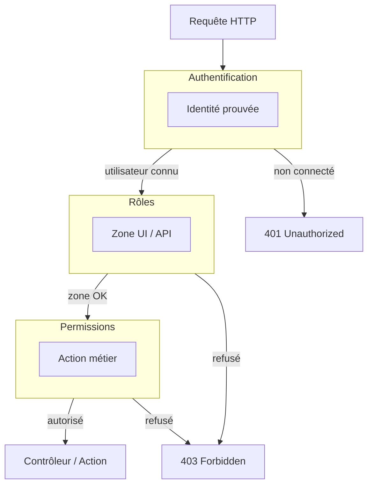
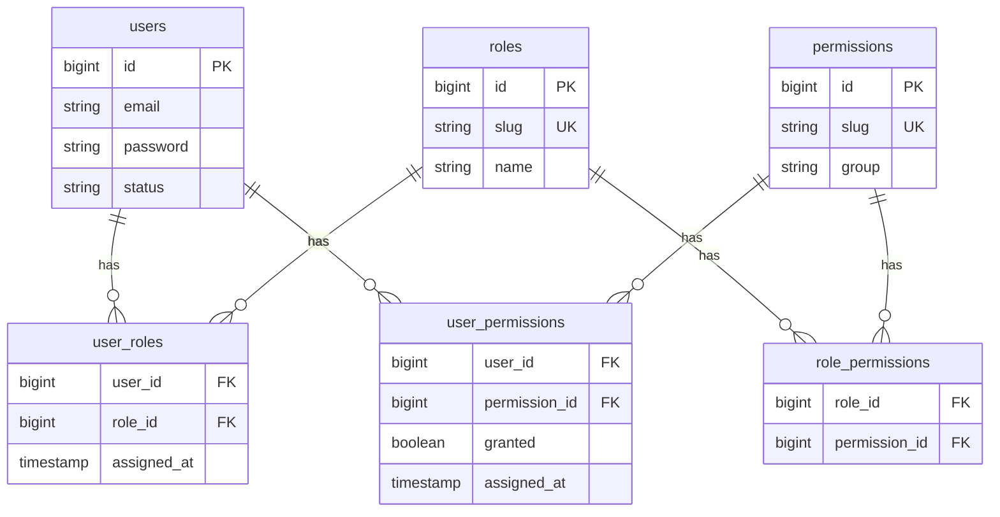
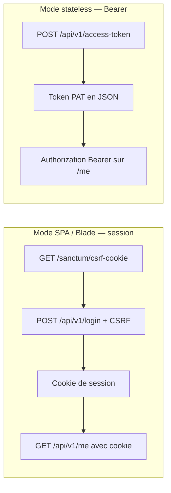
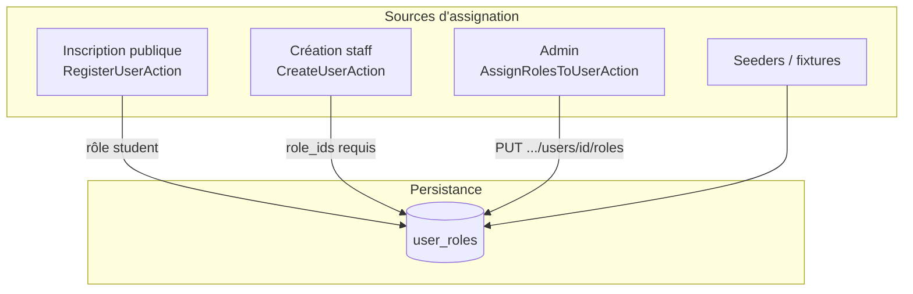
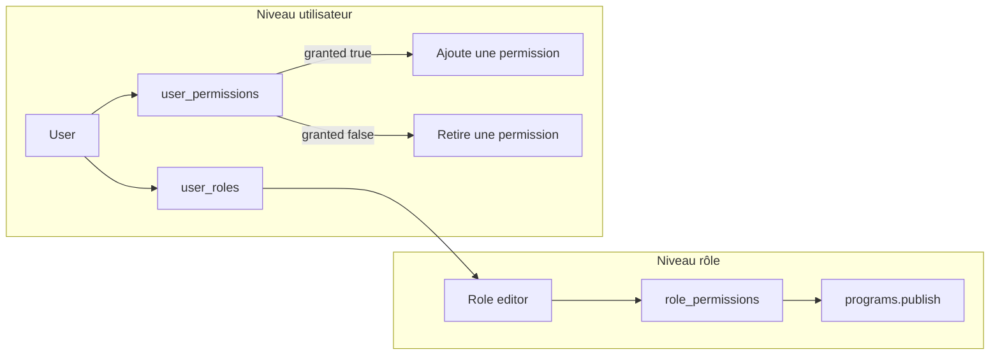
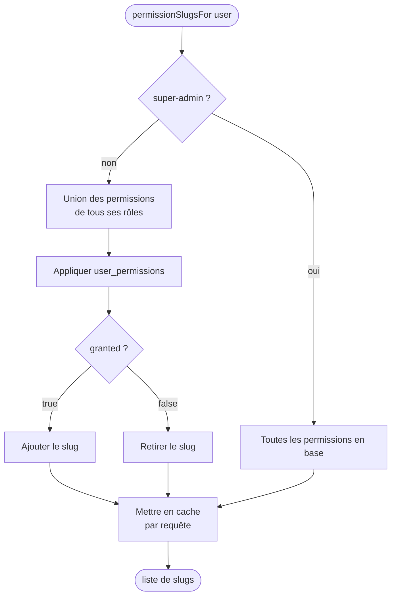
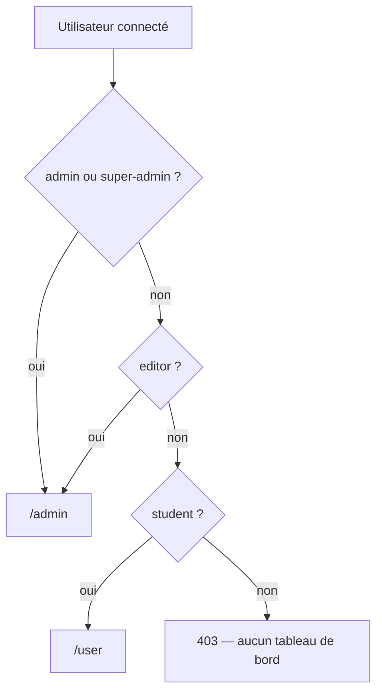

# Guide — Authentification, rôles et permissions

> Documentation détaillée du fonctionnement réel du backend **laravel-webkin** (mai 2026).  
> Documents connexes : [SANCTUM_REGISTER_AND_LOGIN_FLOW.md](./SANCTUM_REGISTER_AND_LOGIN_FLOW.md), [IDENTITE_ACCES_PERMISSIONS_ROLES_AUTH.fr.md](./IDENTITE_ACCES_PERMISSIONS_ROLES_AUTH.fr.md)

---

## 1. Vue d’ensemble : trois couches distinctes

L’application sépare volontairement trois notions. Les confondre mène à des failles de sécurité ou à des menus incohérents.

| Couche | Question | Mécanisme principal |
|--------|----------|---------------------|
| **Authentification** | *Qui est connecté ?* | Laravel Sanctum + guard `web` (session) ou token Bearer (PAT) |
| **Rôles** | *Dans quelle **zone** de l’app ?* | Tables `roles` / `user_roles`, middleware `role:` |
| **Permissions** | *Peut-il faire **cette action** ?* | Tables `permissions` + pivots, `PermissionResolver`, middleware `permission:`, policies |

Un quatrième axe existe en parallèle : **`UserStatus`** (`active`, `suspended`, …) — le compte peut-il se connecter, indépendamment des rôles (non détaillé ici).



**Règle d’or :** le middleware `role:` protège une **zone** (étudiant vs staff). Les **policies** et le middleware `permission:` protègent des **actions** fines (publier un programme, gérer les utilisateurs).

---

## 2. Modèle de données

### 2.1 Schéma relationnel



### 2.2 Rôles du projet

| Slug (`RoleSlug`) | Libellé | Zone UI (local) | Usage |
|-------------------|---------|-----------------|--------|
| `student` | Étudiant | `/user` | Inscription publique par défaut |
| `editor` | Éditeur | `/admin` | Contenu, programmes, devoirs |
| `admin` | Administrateur | `/admin` | Back-office opérationnel |
| `super-admin` | Super administrateur | `/admin` | Bypass permissions (voir §5) |

> **Note :** le slug est `super-admin` (tiret), pas `super_admin`.

### 2.3 Permissions (exemples)

Convention : `{module}.{action}` — enum `PermissionSlug` :

| Slug | Exemple d’usage |
|------|-----------------|
| `users.view`, `users.manage`, … | Gestion des comptes |
| `programs.view`, `programs.publish` | Catalogue / publication |
| `enrollments.approve` | Validation d’inscriptions |
| `assignments.submit`, `assignments.review` | Devoirs |
| `cohorts.manage_schedules` | Plannings |
| `settings.manage` | Paramètres plateforme |

Les permissions de référence sont créées par `PermissionSeeder` et assignées aux rôles par `RoleSeeder`.

---

## 3. Authentification (Sanctum)

### 3.1 Configuration

| Fichier | Rôle |
|---------|------|
| `config/sanctum.php` | Guard `['web']`, domaines `stateful` pour les cookies SPA |
| `bootstrap/app.php` | `$middleware->statefulApi()` — active cookies + CSRF sur l’API |
| `routes/api.php` | Routes publiques, protégées `auth:sanctum`, login sous middleware `web` |

Sanctum vérifie d’abord la **session** du guard `web`, puis un **Personal Access Token** (Bearer) si présent.

### 3.2 Deux modes de connexion



#### Mode session (navigateur, pages Blade locales)

1. Le client appelle `GET /sanctum/csrf-cookie`.
2. `POST /api/v1/login` (groupe middleware `web` → session + validation CSRF).
3. `LoginUserAction` authentifie via `Auth::guard('web')->attempt()`, régénère la session, charge `roles`.
4. Les requêtes suivantes (`GET /api/v1/me`, zones API) passent par `auth:sanctum` qui lit la session.

Fichiers clés :

- `LoginController` → `LoginUserAction`
- `CurrentUserController` → utilisateur + `UserResource`
- `LogoutController` → `LogoutUserAction`

#### Mode Bearer (Postman, scripts, mobile)

1. `POST /api/v1/access-token` avec `{ email, password, device_name }`.
2. `IssuePersonalAccessTokenAction` vérifie le mot de passe et crée un PAT Sanctum.
3. Réponse : `{ token, token_type, user }` (sans session).
4. `GET /api/v1/me` avec header `Authorization: Bearer {token}`.

### 3.3 Inscription publique

`POST /api/v1/register` → `RegisterUserAction` :

- Crée l’utilisateur.
- Assigne **automatiquement** le rôle `student` via `RoleRepositoryInterface::syncUserRoles`.
- Ne crée pas de session : le client doit ensuite appeler `login` ou `access-token`.

### 3.4 Réponse utilisateur (`UserResource`)

Pour l’utilisateur connecté qui consulte **son propre** profil (`GET /me`, login), le JSON inclut :

| Champ | Source |
|-------|--------|
| `roles` | Relation Eloquent `roles` (si chargée) |
| `permissions` | `PermissionResolverInterface::permissionSlugsFor()` |
| `dashboard_path` | `PostLoginRedirectResolver::pathFor()` |

Ces champs sont **absents** si la ressource représente un autre utilisateur (sécurité).

---

## 4. Assignation des rôles

### 4.1 Où sont stockés les rôles ?

Table pivot **`user_roles`** : un utilisateur peut avoir **plusieurs** rôles (ex. `student` + `admin` en théorie ; la redirection suit la priorité la plus haute).

### 4.2 Comment un rôle est attribué ?



| Mécanisme | Endpoint / déclencheur | Rôle typique |
|-----------|------------------------|--------------|
| Inscription | `POST /api/v1/register` | `student` |
| Création admin | `POST /api/v1/admin/users` | `role_ids` au choix (staff) |
| Sync admin | `PUT /api/v1/admin/users/{user}/roles` | Remplace tous les rôles |
| Seeder | `RoleSeeder` | Données de référence |

**Action :** `AssignRolesToUserAction` valide les IDs et appelle `RoleRepositoryInterface::syncUserRoles()` (équivalent Eloquent `sync` sur la relation).

### 4.3 Vérification côté code (`User`)

```php
$user->hasRole(RoleSlug::Student);
$user->hasRole('admin');
$user->hasAnyRole([RoleSlug::Admin, RoleSlug::SuperAdmin]);
$user->isStudent();
$user->isEditor();
$user->isAdminAreaUser();  // admin ou super-admin
$user->isStaff();           // admin, editor ou super-admin
```

### 4.4 Protection par middleware `role:`

**Fichier :** `app/Http/Middleware/EnsureUserHasRole.php`  
**Alias :** `role` (déclaré dans `bootstrap/app.php`)

- Paramètres : slugs séparés par des virgules → logique **OU** (au moins un rôle requis).
- Exemple : `role:admin,editor,super-admin` accepte l’un des trois.

**Routes web (local) :**

| Route | Middleware |
|-------|----------------|
| `/user` | `auth` + `role:student` |
| `/admin` | `auth` + `role:admin,editor,super-admin` |

**Routes API :**

| Préfixe | Middleware rôle |
|---------|-----------------|
| `/api/v1/student/*` | `role:student` |
| `/api/v1/admin/*` | `role:admin,editor,super-admin` |
| Gestion identité (`/admin/users`, …) | **en plus** `role:admin,super-admin` |

---

## 5. Assignation et calcul des permissions

### 5.1 Deux niveaux d’assignation

| Niveau | Table pivot | Effet |
|--------|-------------|--------|
| **Par rôle** | `role_permissions` | Tous les utilisateurs ayant ce rôle héritent des permissions du rôle |
| **Par utilisateur** | `user_permissions` | Override individuel (`granted` true/false) |



### 5.2 Calcul des permissions effectives

**Service :** `DefaultPermissionResolver` (interface `PermissionResolverInterface`, binding dans `DomainServiceProvider`).

Algorithme pour un `User` :



1. **Union** des slugs liés aux rôles de l’utilisateur (`roles` → `role_permissions` → `permissions`).
2. **Overrides** `user_permissions` :
   - `granted = true` → ajoute la permission (même si aucun rôle ne l’a).
   - `granted = false` → retire la permission (deny explicite).
3. **Super-admin** : `hasPermission()` retourne toujours `true` ; `permissionSlugsFor()` retourne tous les slugs en base.

Le résultat est **mis en cache en mémoire** pour la durée de la requête (évite les requêtes N+1).

### 5.3 Vérification côté code

```php
$user->hasPermission(PermissionSlug::ProgramsPublish);
$user->hasPermission('users.manage');
```

Délègue toujours à `PermissionResolverInterface`.

### 5.4 Protection par middleware `permission:`

**Fichier :** `app/Http/Middleware/EnsureUserHasPermission.php`

- Paramètres : slugs séparés par virgules → logique **ET** (toutes les permissions requises).
- Exemple : `permission:users.manage` sur les routes de gestion des comptes.

### 5.5 Policies Laravel (actions métier)

Les policies dans `app/Policies/` encapsulent les mêmes slugs pour `authorize()` et `$user->can()` :

| Policy | Méthodes notables |
|--------|-------------------|
| `UserPolicy` | `viewAny`, `create`, `update`, `delete` — `users.manage` accorde tout via `before()` |
| `ProgramPolicy` | `viewAny`, `view`, `publish` |
| `EnrollmentPolicy` | `approve` |
| `AssignmentPolicy` | `review`, `submit` |
| `CohortPolicy` | `manageSchedules` |
| `SettingPolicy` | `viewAny`, `update` |

Enregistrement : `AppServiceProvider::boot()` via `Gate::policy(...)`.

Les **Form Requests** admin appellent ces policies, ex. :

```php
// ManageUsersRequest
return $this->user()?->can('viewAny', User::class) ?? false;
```

---

## 6. Workflow complet d’une requête API protégée

Exemple : `PUT /api/v1/admin/users/5/roles` (assigner des rôles).

```mermaid
sequenceDiagram
    participant C as Client
    participant S as Sanctum
    participant Auth as auth:sanctum
    participant RoleMW as role:admin,super-admin
    participant PermMW as permission:users.manage
    participant FR as AssignUserRolesRequest
    participant Act as AssignRolesToUserAction
    participant DB as Base de données

    C->>S: Bearer ou cookie session
    S->>Auth: Utilisateur authentifié ?
    Auth-->>RoleMW: User #id
    RoleMW->>RoleMW: hasAnyRole(admin, super-admin) ?
  alt rôle OK
        RoleMW->>PermMW: hasPermission(users.manage) ?
    alt permission OK
            PermMW->>FR: authorize update User
            FR->>Act: execute(DTO)
            Act->>DB: sync user_roles
            Act-->>C: 200 UserResource + roles
        else
            PermMW-->>C: 403
        end
    else
        RoleMW-->>C: 403
    end
    else
        Auth-->>C: 401
    end
```

---

## 7. Endpoints admin — gestion identité (étape 10)

Tous exigent : `auth:sanctum` + zone `admin` + `role:admin,super-admin` + `permission:users.manage`.

| Méthode | Route | Action | Effet |
|---------|-------|--------|--------|
| `GET` | `/api/v1/admin/users` | — | Placeholder liste (à étendre) |
| `POST` | `/api/v1/admin/users` | `CreateUserAction` | Crée un utilisateur + `role_ids` |
| `PUT` | `/api/v1/admin/users/{user}/roles` | `AssignRolesToUserAction` | Sync `user_roles` |
| `PUT` | `/api/v1/admin/users/{user}/permissions` | `GrantUserPermissionAction` | Upsert `user_permissions` |
| `PUT` | `/api/v1/admin/roles/{role}/permissions` | `AssignPermissionsToRoleAction` | Sync `role_permissions` |

**Exemple — override permission utilisateur :**

```http
PUT /api/v1/admin/users/5/permissions
Content-Type: application/json

{
  "permission_id": 3,
  "granted": false
}
```

Retire la permission `#3` pour l’utilisateur `#5`, même si un rôle la lui accordait.

---

## 8. Redirections post-connexion (web)

**Service :** `PostLoginRedirectResolver`

Priorité :



- Route passerelle : `GET /dashboard` (middleware `auth`) → redirige selon les rôles.
- Page `login.blade.php` : après `POST /api/v1/login`, lit `dashboard_path` dans le JSON et redirige le navigateur.

---

## 9. Matrice rôles → permissions (seed de référence)

Source : `database/seeders/RoleSeeder.php` (après `PermissionSeeder`).

| Rôle | Permissions (résumé) |
|------|------------------------|
| **student** | `assignments.submit` |
| **editor** | `programs.view`, `programs.publish`, `assignments.review`, `cohorts.manage_schedules` |
| **admin** | users.* (view/manage/create/update), programs.*, `enrollments.approve`, `assignments.review`, `cohorts.manage_schedules` |
| **super-admin** | **Toutes** les valeurs de `PermissionSlug` |

Les permissions effectives peuvent diverger du seed si un admin modifie `role_permissions` ou `user_permissions` via l’API.

---

## 10. Carte des fichiers importants

```text
backend/
├── app/
│   ├── Application/IdentityAccess/Actions/
│   │   ├── LoginUserAction.php
│   │   ├── RegisterUserAction.php
│   │   ├── CreateUserAction.php
│   │   ├── AssignRolesToUserAction.php
│   │   ├── AssignPermissionsToRoleAction.php
│   │   └── GrantUserPermissionAction.php
│   ├── Domain/IdentityAccess/
│   │   ├── Enums/RoleSlug.php, PermissionSlug.php
│   │   ├── Services/
│   │   │   ├── DefaultPermissionResolver.php
│   │   │   └── PostLoginRedirectResolver.php
│   │   └── Repositories/
│   │       ├── RoleRepositoryInterface.php
│   │       └── PermissionRepositoryInterface.php
│   ├── Http/
│   │   ├── Middleware/EnsureUserHasRole.php
│   │   ├── Middleware/EnsureUserHasPermission.php
│   │   ├── Controllers/Api/V1/Auth/...
│   │   ├── Controllers/Api/V1/Admin/...
│   │   └── Resources/IdentityAccess/UserResource.php
│   ├── Policies/UserPolicy.php, ProgramPolicy.php, ...
│   └── Models/User.php, Role.php, Permission.php
├── routes/api.php, web.php
├── bootstrap/app.php
├── config/sanctum.php
└── database/seeders/PermissionSeeder.php, RoleSeeder.php
```

---

## 11. Tests automatisés

Suite Pest : `tests/Feature/IdentityAccess/` (47 tests) — couvre login Sanctum, middleware, resolver, policies, zones API et actions admin.

```bash
cd backend
php artisan test --filter=IdentityAccess
```

---

## 12. Récapitulatif décisionnel

| Besoin | Utiliser |
|--------|----------|
| Savoir si quelqu’un est connecté | `auth:sanctum`, `$request->user()` |
| Restreindre une zone (étudiant / staff) | Middleware `role:` |
| Restreindre une action (publish, manage users) | Middleware `permission:` et/ou Policy + Form Request |
| Afficher les permissions dans le front | `GET /api/v1/me` → champs `permissions`, `dashboard_path` |
| Donner / retirer un rôle | `PUT /api/v1/admin/users/{id}/roles` |
| Donner / retirer une permission à un rôle | `PUT /api/v1/admin/roles/{id}/permissions` |
| Exception individuelle (grant/deny) | `PUT /api/v1/admin/users/{id}/permissions` |
| Compte tout-puissant | Rôle `super-admin` |

---

*Dernière mise à jour : aligné sur l’implémentation des étapes 5 à 10 du guide identité & accès.*
