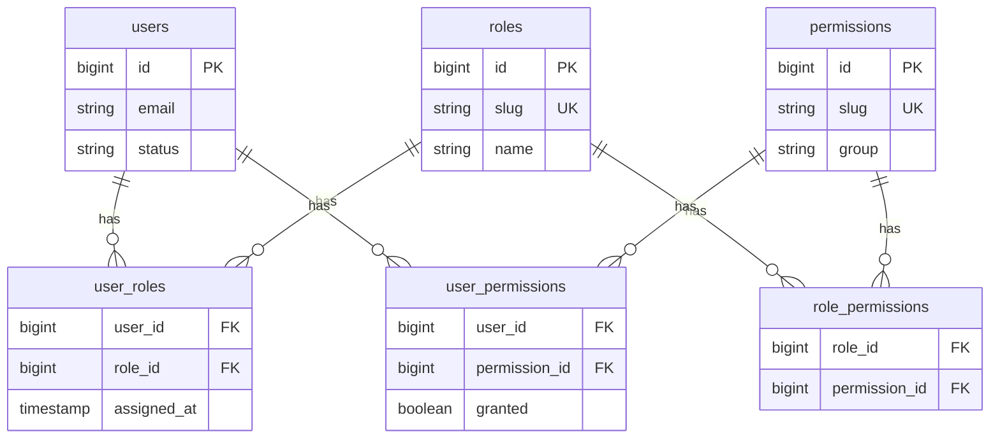
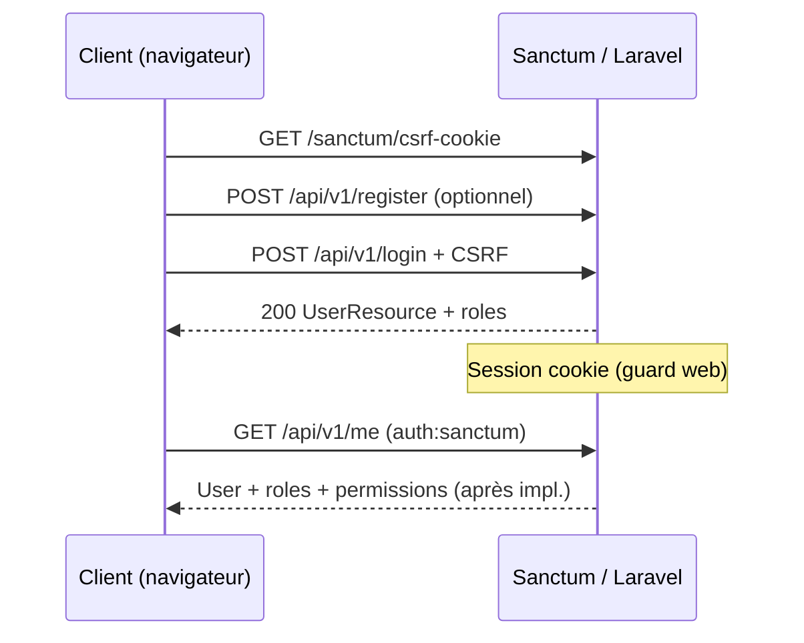

# Identité & accès — permissions, rôles, authentification et redirections

> Guide pas à pas pour le backend `laravel-webkin`, aligné sur la structure **modulaire / DDD léger** du projet.  
> Documents connexes : [SANCTUM_REGISTER_AND_LOGIN_FLOW.md](./SANCTUM_REGISTER_AND_LOGIN_FLOW.md), [ADMIN_AND_STUDENT_AREAS_GUIDE.fr.md](./ADMIN_AND_STUDENT_AREAS_GUIDE.fr.md)

---

## 0. Vue d’ensemble

### 0.1 Trois couches distinctes

| Couche | Question | Où ça vit |
|--------|----------|-----------|
| **Authentification** | « Qui est connecté ? » | Sanctum + guard `web`, `POST /api/v1/login`, PAT |
| **Rôles** | « Dans quelle **zone** de l’app ? » | `roles`, `user_roles`, middleware `role:` |
| **Permissions** | « Peut-il faire **cette action** ? » | `permissions`, `role_permissions`, `user_permissions`, policies |

`UserStatus` (`active`, `suspended`, …) est une **quatrième** notion : le compte peut-il se connecter, indépendamment des rôles.

### 0.2 Rôles cibles du projet

| Slug | Nom affiché | Zone UI (recommandée) | Description |
|------|-------------|----------------------|-------------|
| `student` | Student | `/user` | Apprenant ; assigné à l’inscription publique |
| `instructor` | Instructor | `/instructor` | Formateur (cohortes, devoirs, mentoring) |
| `admin` | Admin | `/admin` | Back-office opérationnel |
| `super_admin` | Super Admin | `/admin` | Contrôle plateforme (toutes permissions ou bypass) |

Utilisez le slug `super_admin` (underscore) partout : enum, base, middleware — pas de mélange avec `super-admin`.

### 0.3 Arborescence `IdentityAccess` dans le projet

```text
backend/
├── app/
│   ├── Application/IdentityAccess/          # Cas d’usage (orchestration)
│   │   ├── Actions/                         # RegisterUserAction, LoginUserAction, …
│   │   └── DTOs/                            # RegisterUserData, LoginData, …
│   ├── Domain/IdentityAccess/               # Règles métier pures
│   │   ├── Enums/                          # RoleSlug, PermissionSlug (à créer)
│   │   ├── Repositories/                    # Interfaces
│   │   └── Services/                        # PermissionResolver, PostLoginRedirectResolver, …
│   ├── Infrastructure/Persistence/Repositories/IdentityAccess/
│   │   └── Eloquent*Repository.php
│   ├── Http/
│   │   ├── Controllers/Api/V1/Auth/         # Register, Login, Me, …
│   │   ├── Requests/Auth/                   # Validation HTTP
│   │   ├── Resources/IdentityAccess/        # UserResource, RoleResource
│   │   └── Middleware/                      # EnsureUserHasRole, EnsureUserHasPermission
│   └── Models/                              # User, Role, Permission (Permission à créer)
├── database/
│   ├── migrations/                          # roles, user_roles, permissions, pivots
│   └── seeders/                             # RoleSeeder, PermissionSeeder
├── routes/
│   ├── api.php                              # /api/v1/…
│   └── web.php                              # Blade local : /login, /user, /admin
├── bootstrap/app.php                        # statefulApi(), alias middleware
└── docs/                                    # Ce fichier
```

### 0.4 État actuel vs à implémenter

| Élément | État |
|---------|------|
| Tables `roles`, `user_roles` | ✅ Migrations existantes |
| Tables `permissions`, `role_permissions`, `user_permissions` | ✅ Migrations créées |
| Modèle `Permission`, relations | ⬜ À créer |
| Enums `RoleSlug`, `PermissionSlug` | ⬜ À créer |
| `PermissionSeeder` + rôles complets dans `RoleSeeder` | ⬜ À créer |
| `PermissionResolver` + middleware | ⬜ À créer |
| Auth Sanctum (register, login, PAT, me) | ✅ En place |
| Redirection post-login par rôle | ⬜ Partielle (`login.blade.php` → toujours `/user`) |
| Middleware `role:` sur `/user`, `/admin` | ⬜ À créer |

---

## 1. Modèle de données

### 1.1 Schéma relationnel



### 1.2 Migrations déjà en place

| Fichier | Table |
|---------|--------|
| `2026_03_28_161055_create_roles_table.php` | `roles` |
| `2026_03_28_161057_create_user_roles_table.php` | `user_roles` |
| `2026_05_17_113903_create_permissions_table.php` | `permissions` |
| `2026_05_17_113911_create_role_permissions_table.php` | `role_permissions` |
| `2026_05_17_113912_create_user_permissions_table.php` | `user_permissions` |

**Commande :**

```bash
cd backend
php artisan migrate
```

### 1.3 Calcul des permissions effectives

Pour un `User` donné :

1. Union des permissions liées à **tous ses rôles** (`role_permissions`).
2. Application des lignes **`user_permissions`** :
   - `granted = true` → ajoute la permission (même si aucun rôle ne l’a).
   - `granted = false` → retire la permission (override négatif).

Mettre en cache le résultat **par requête** dans le resolver pour éviter les requêtes N+1.

---

## 2. Étape 1 — Modèle `Permission` et relations Eloquent

### 2.1 Créer `app/Models/Permission.php`

```php
<?php

namespace App\Models;

use Illuminate\Database\Eloquent\Model;
use Illuminate\Database\Eloquent\Relations\BelongsToMany;

class Permission extends Model
{
    protected $fillable = ['name', 'slug', 'description', 'group'];

    public function roles(): BelongsToMany
    {
        return $this->belongsToMany(Role::class, 'role_permissions')->withTimestamps();
    }

    public function users(): BelongsToMany
    {
        return $this->belongsToMany(User::class, 'user_permissions')
            ->withTimestamps()
            ->withPivot(['granted', 'assigned_at']);
    }
}
```

### 2.2 Étendre `app/Models/Role.php`

```php
public function permissions(): BelongsToMany
{
    return $this->belongsToMany(Permission::class, 'role_permissions')->withTimestamps();
}
```

### 2.3 Étendre `app/Models/User.php`

```php
public function permissions(): BelongsToMany
{
    return $this->belongsToMany(Permission::class, 'user_permissions')
        ->withTimestamps()
        ->withPivot(['granted', 'assigned_at']);
}
```

---

## 3. Étape 2 — Enums `RoleSlug` et `PermissionSlug`

Emplacement : `app/Domain/IdentityAccess/Enums/`.

### 3.1 `RoleSlug.php`

```php
<?php

namespace App\Domain\IdentityAccess\Enums;

enum RoleSlug: string
{
    case Student = 'student';
    case Instructor = 'instructor';
    case Admin = 'admin';
    case SuperAdmin = 'super_admin';

    /** Accès zone back-office (/admin). */
    public static function adminAreaSlugs(): array
    {
        return [self::Admin->value, self::SuperAdmin->value];
    }

    /** Accès zone formateur (/instructor). */
    public static function instructorAreaSlugs(): array
    {
        return [self::Instructor->value];
    }

    /** Accès zone apprenant (/user). */
    public static function studentAreaSlugs(): array
    {
        return [self::Student->value];
    }

    /** Tout rôle « staff » (hors simple étudiant). */
    public static function staffSlugs(): array
    {
        return [
            self::Instructor->value,
            self::Admin->value,
            self::SuperAdmin->value,
        ];
    }
}
```

### 3.2 `PermissionSlug.php` (exemples alignés sur vos modules)

Convention : `{module}.{action}`.

```php
<?php

namespace App\Domain\IdentityAccess\Enums;

enum PermissionSlug: string
{
  // Users
    case UsersView = 'users.view';
    case UsersManage = 'users.manage';

  // Programs / curriculum
    case ProgramsView = 'programs.view';
    case ProgramsPublish = 'programs.publish';

  // Enrollments
    case EnrollmentsApprove = 'enrollments.approve';

  // Assignments
    case AssignmentsReview = 'assignments.review';
    case AssignmentsSubmit = 'assignments.submit';

  // Cohorts / instructeur
    case CohortsManageSchedules = 'cohorts.manage_schedules';

  // Platform
    case SettingsManage = 'settings.manage';
}
```

Ajoutez les cas au fil des endpoints ; le seeder reste la liste authoritative en base.

---

## 4. Étape 3 — Seeders

### 4.1 `database/seeders/PermissionSeeder.php`

```php
<?php

namespace Database\Seeders;

use App\Models\Permission;
use Illuminate\Database\Seeder;

class PermissionSeeder extends Seeder
{
    public function run(): void
    {
        $permissions = [
            ['slug' => 'users.view', 'name' => 'Voir les utilisateurs', 'group' => 'users'],
            ['slug' => 'users.manage', 'name' => 'Gérer les utilisateurs', 'group' => 'users'],
            ['slug' => 'programs.publish', 'name' => 'Publier un programme', 'group' => 'programs'],
            ['slug' => 'enrollments.approve', 'name' => 'Approuver une inscription', 'group' => 'enrollments'],
            ['slug' => 'assignments.submit', 'name' => 'Soumettre un devoir', 'group' => 'assignments'],
            ['slug' => 'assignments.review', 'name' => 'Corriger un devoir', 'group' => 'assignments'],
            ['slug' => 'cohorts.manage_schedules', 'name' => 'Gérer les plannings', 'group' => 'cohorts'],
            ['slug' => 'settings.manage', 'name' => 'Paramètres plateforme', 'group' => 'platform'],
        ];

        foreach ($permissions as $row) {
            Permission::query()->firstOrCreate(['slug' => $row['slug']], $row);
        }
    }
}
```

### 4.2 Mettre à jour `RoleSeeder.php`

```php
<?php

namespace Database\Seeders;

use App\Models\Permission;
use App\Models\Role;
use Illuminate\Database\Seeder;

class RoleSeeder extends Seeder
{
    public function run(): void
    {
        $roles = [
            ['slug' => 'student', 'name' => 'Student', 'description' => 'Apprenant (inscription publique).'],
            ['slug' => 'instructor', 'name' => 'Instructor', 'description' => 'Formateur.'],
            ['slug' => 'admin', 'name' => 'Admin', 'description' => 'Administrateur back-office.'],
            ['slug' => 'super_admin', 'name' => 'Super Admin', 'description' => 'Contrôle total.'],
        ];

        foreach ($roles as $role) {
            Role::query()->firstOrCreate(['slug' => $role['slug']], $role);
        }

        $this->syncRolePermissions();
    }

    private function syncRolePermissions(): void
    {
        $map = [
            'student' => ['assignments.submit'],
            'instructor' => ['assignments.review', 'cohorts.manage_schedules', 'programs.view'],
            'admin' => [
                'users.view', 'users.manage', 'programs.publish', 'enrollments.approve',
                'assignments.review', 'cohorts.manage_schedules',
            ],
            'super_admin' => Permission::query()->pluck('slug')->all(),
        ];

        foreach ($map as $roleSlug => $permissionSlugs) {
            $role = Role::where('slug', $roleSlug)->first();
            $ids = Permission::whereIn('slug', $permissionSlugs)->pluck('id');
            $role?->permissions()->sync($ids);
        }
    }
}
```

### 4.3 `DatabaseSeeder.php`

```php
$this->call([
    PermissionSeeder::class,
    RoleSeeder::class,
]);
```

**Ordre important :** permissions avant rôles (le `sync` des pivots en dépend).

```bash
php artisan db:seed
```

### 4.4 Inscription publique

`RegisterUserAction` doit continuer à n’assigner que `student` :

```php
private const DEFAULT_STUDENT_ROLE_SLUG = 'student'; // ou RoleSlug::Student->value
```

Ne jamais accepter `role_ids` sur `POST /api/v1/register`.

---

## 5. Étape 4 — Domaine : resolver et repositories

### 5.1 `PermissionResolverInterface`

`app/Domain/IdentityAccess/Services/PermissionResolverInterface.php` :

```php
<?php

namespace App\Domain\IdentityAccess\Services;

use App\Domain\IdentityAccess\Enums\PermissionSlug;
use App\Models\User;

interface PermissionResolverInterface
{
    public function hasPermission(User $user, PermissionSlug|string $permission): bool;

    /** @return list<string> */
    public function permissionSlugsFor(User $user): array;
}
```

### 5.2 `DefaultPermissionResolver`

`app/Domain/IdentityAccess/Services/DefaultPermissionResolver.php` — implémentation avec :

- requête des slugs via `roles.permissions` ;
- merge des `user_permissions` (granted true/false) ;
- bypass optionnel : si l’utilisateur a le rôle `super_admin`, retourner toutes les permissions (ou toujours `true` dans `hasPermission`).

### 5.3 Enregistrement

Dans `app/Providers/DomainServiceProvider.php` :

```php
$this->app->bind(
    \App\Domain\IdentityAccess\Services\PermissionResolverInterface::class,
    \App\Domain\IdentityAccess\Services\DefaultPermissionResolver::class,
);
```

### 5.4 `PermissionRepositoryInterface` (optionnel, cohérent avec le projet)

`app/Domain/IdentityAccess/Repositories/PermissionRepositoryInterface.php` :

- `findBySlug(string $slug): ?Permission`
- `syncRolePermissions(Role $role, array $permissionIds): void`
- `grantUserPermission(User $user, int $permissionId, bool $granted = true): void`

Implémentation : `Infrastructure/Persistence/Repositories/IdentityAccess/EloquentPermissionRepository.php`  
Binding : `RepositoryServiceProvider.php` (comme `RoleRepositoryInterface`).

---

## 6. Étape 5 — Helpers `User` et middleware

### 6.1 Méthodes sur `User`

```php
public function hasRole(RoleSlug|string $role): bool { /* … */ }
public function hasAnyRole(array $roles): bool { /* … */ }
public function hasPermission(PermissionSlug|string $permission): bool
{
    return app(PermissionResolverInterface::class)->hasPermission($this, $permission);
}
public function isStudent(): bool
{
    return $this->hasRole(RoleSlug::Student);
}
public function isInstructor(): bool
{
    return $this->hasRole(RoleSlug::Instructor);
}
public function isAdminAreaUser(): bool
{
    return $this->hasAnyRole(RoleSlug::adminAreaSlugs());
}
```

### 6.2 Middleware `EnsureUserHasRole`

`app/Http/Middleware/EnsureUserHasRole.php` — paramètres : slugs séparés par des virgules.

```php
// routes/web.php
Route::middleware(['auth', 'role:student'])->group(/* /user */);
Route::middleware(['auth', 'role:instructor'])->group(/* /instructor */);
Route::middleware(['auth', 'role:admin,super_admin'])->group(/* /admin */);
```

Alias dans `bootstrap/app.php` :

```php
$middleware->alias([
    'role' => \App\Http\Middleware\EnsureUserHasRole::class,
    'permission' => \App\Http\Middleware\EnsureUserHasPermission::class,
]);
```

### 6.3 Middleware `EnsureUserHasPermission`

Pour les routes API métier :

```php
Route::middleware(['auth:sanctum', 'permission:programs.publish'])->post(/* … */);
```

Les **policies** Laravel (`ProgramPolicy`, etc.) restent préférables pour la logique fine ; le middleware convient aux routes transverses.

---

## 7. Étape 6 — Authentification (déjà en place + extensions)

Référence détaillée : [SANCTUM_REGISTER_AND_LOGIN_FLOW.md](./SANCTUM_REGISTER_AND_LOGIN_FLOW.md).

### 7.1 Flux session (SPA / Blade)



| Endpoint | Fichier | Action |
|----------|---------|--------|
| `POST /api/v1/register` | `RegisterController` | `RegisterUserAction` |
| `POST /api/v1/login` | `LoginController` | `LoginUserAction` → `$user->load('roles')` |
| `GET /api/v1/me` | `CurrentUserController` | utilisateur + `roles` |
| `POST /api/v1/logout` | `LogoutController` | `LogoutUserAction` |

Configuration clé :

- `bootstrap/app.php` → `$middleware->statefulApi()`
- `config/sanctum.php` → `guard` = `['web']`, `stateful` domains
- `routes/api.php` → groupe `web` sur `login` uniquement

### 7.2 Flux stateless (Postman / mobile)

| Endpoint | Usage |
|----------|--------|
| `POST /api/v1/access-token` | `{ email, password, device_name }` → Bearer token |
| `GET /api/v1/me` | Header `Authorization: Bearer …` |

Pas de redirection HTTP : le client lit `roles` / `permissions` dans le JSON.

### 7.3 Étendre `CurrentUserController` et `LoginUserAction`

Après implémentation des permissions :

```php
// CurrentUserController
$user = $request->user()->load(['roles', 'roles.permissions']);

// LoginUserAction — déjà load('roles') ; optionnel :
return $user->load(['roles.permissions']);
```

### 7.4 `UserResource` — exposer rôles et permissions

`app/Http/Resources/IdentityAccess/UserResource.php` :

```php
'roles' => RoleResource::collection($this->whenLoaded('roles')),
'permissions' => $this->when(
    $request->user()?->is($this->resource),
    fn () => app(PermissionResolverInterface::class)->permissionSlugsFor($this->resource),
),
'dashboard_path' => $this->when(
    $request->user()?->is($this->resource),
    fn () => app(PostLoginRedirectResolver::class)->pathFor($this->resource),
),
```

Le frontend Vue pourra masquer les menus ; **la sécurité reste côté middleware et policies**.

---

## 8. Étape 7 — Redirections post-connexion

### 8.1 Règle de priorité (zones)

| Priorité | Condition | Chemin |
|----------|-----------|--------|
| 1 | `super_admin` ou `admin` | `/admin` |
| 2 | `instructor` (sans rôle admin) | `/instructor` |
| 3 | `student` | `/user` |
| 4 | Aucun rôle reconnu | Erreur 403 ou page dédiée |

Un utilisateur avec **plusieurs rôles** suit la **priorité la plus haute** (ex. `student` + `admin` → `/admin`).

### 8.2 `PostLoginRedirectResolver`

`app/Domain/IdentityAccess/Services/PostLoginRedirectResolver.php` :

```php
<?php

namespace App\Domain\IdentityAccess\Services;

use App\Domain\IdentityAccess\Enums\RoleSlug;
use App\Models\User;
use Symfony\Component\HttpKernel\Exception\HttpException;

final class PostLoginRedirectResolver
{
    public const STUDENT_HOME = '/user';
    public const INSTRUCTOR_HOME = '/instructor';
    public const ADMIN_HOME = '/admin';

    public function pathFor(User $user): string
    {
        if ($user->hasAnyRole(RoleSlug::adminAreaSlugs())) {
            return self::ADMIN_HOME;
        }

        if ($user->hasRole(RoleSlug::Instructor)) {
            return self::INSTRUCTOR_HOME;
        }

        if ($user->hasRole(RoleSlug::Student)) {
            return self::STUDENT_HOME;
        }

        throw new HttpException(403, 'Aucun rôle ne définit de tableau de bord.');
    }
}
```

Binding optionnel dans `DomainServiceProvider`.

### 8.3 Routes web locales (`routes/web.php`)

Aujourd’hui (environnement `local` uniquement) :

```php
Route::middleware('auth')->group(function (): void {
    Route::view('/user', 'user.index')->name('user.dashboard');
    Route::view('/admin', 'admin.index')->name('admin.dashboard');
});
```

**À ajouter :**

```php
Route::view('/instructor', 'instructor.index')->name('instructor.dashboard');
// + middleware role: sur chaque groupe (voir § 6.2)
```

### 8.4 Redirection côté client — `login.blade.php`

Fichier actuel : `resources/views/auth/login.blade.php` (redirige toujours vers `/user`).

Remplacer la constante fixe par la logique du resolver (côté JS, miroir de la priorité) :

```javascript
const ADMIN_HOME = '/admin';
const INSTRUCTOR_HOME = '/instructor';
const STUDENT_HOME = '/user';
const ADMIN_SLUGS = ['admin', 'super_admin'];

function dashboardPathFromLoginPayload(json) {
    const slugs = (json?.data?.roles ?? []).map((r) => r.slug);
    if (slugs.some((s) => ADMIN_SLUGS.includes(s))) return ADMIN_HOME;
    if (slugs.includes('instructor')) return INSTRUCTOR_HOME;
    if (slugs.includes('student')) return STUDENT_HOME;
    return json?.data?.dashboard_path ?? null;
}
```

**Encore mieux :** utiliser `dashboard_path` renvoyé par l’API une fois `UserResource` étendu.

### 8.5 Route passerelle `GET /dashboard`

```php
Route::get('/dashboard', function (Request $request, PostLoginRedirectResolver $resolver) {
    return redirect()->to($resolver->pathFor($request->user()));
})->middleware('auth')->name('dashboard');
```

- Succès login → `route('dashboard')`
- Invité déjà connecté sur `/login` → même redirection (middleware `guest` personnalisé)

### 8.6 Menu `auth-menu.blade.php`

Afficher uniquement les liens autorisés :

```blade
@auth
    @if (auth()->user()->isStudent())
        <a href="{{ route('user.dashboard') }}">Apprenant</a>
    @endif
    @if (auth()->user()->isInstructor())
        <a href="{{ route('instructor.dashboard') }}">Formateur</a>
    @endif
    @if (auth()->user()->isAdminAreaUser())
        <a href="{{ route('admin.dashboard') }}">Admin</a>
    @endif
@endauth
```

---

## 9. Étape 8 — Routes API par zone (évolution)

Structure recommandée dans `routes/api.php` :

```php
Route::prefix('v1')->group(function (): void {
    // Public
    Route::post('register', RegisterController::class);
    Route::post('access-token', IssueAccessTokenController::class)->middleware('throttle:10,1');

    Route::middleware('auth:sanctum')->group(function (): void {
        Route::get('me', CurrentUserController::class);
        Route::post('logout', LogoutController::class);

        Route::middleware('role:student')->prefix('student')->group(function (): void {
            // enrollments, assignments submit…
        });

        Route::middleware('role:instructor')->prefix('instructor')->group(function (): void {
            // plannings, reviews…
        });

        Route::middleware(['role:admin,super_admin', 'permission:users.manage'])
            ->prefix('admin')
            ->group(function (): void {
                // gestion utilisateurs…
            });
    });

    Route::middleware('web')->group(function (): void {
        Route::post('login', LoginController::class);
    });
});
```

Contrôleurs fins sous `Http/Controllers/Api/V1/{Student|Instructor|Admin}/` — chaque méthode délègue à une **Action** dans `Application/{Module}/`.

---

## 10. Étape 9 — Policies et Form Requests

Pour chaque module (`Programs`, `Enrollments`, …) :

1. `app/Policies/ProgramPolicy.php` (ou sous-namespace par module).
2. Dans `authorize()` des Form Requests :

```php
public function authorize(): bool
{
    return $this->user()?->hasPermission(PermissionSlug::ProgramsPublish) ?? false;
}
```

3. Enregistrer les policies dans `AuthServiceProvider` ou `bootstrap/app.php` (Laravel 11).

**Règle :** le middleware `role:` protège une **zone** ; la policy protège une **action métier**.

---

## 11. Étape 10 — Actions admin (assignation rôles / permissions)

À placer dans `Application/IdentityAccess/Actions/` (fichiers à créer) :

| Action | Rôle |
|--------|------|
| `AssignRolesToUserAction` | Utilise `RoleRepositoryInterface::syncUserRoles` |
| `AssignPermissionsToRoleAction` | Sync `role_permissions` |
| `GrantUserPermissionAction` | Ligne dans `user_permissions` avec `granted` |
| `CreateUserAction` | Déjà présent — réservé au staff, avec `role_ids` |

DTOs existants : `AssignRolesToUserData`, `CreateRoleData`, etc.

Protéger ces endpoints avec `permission:users.manage` et `role:admin,super_admin`.

---

## 12. Checklist d’implémentation (ordre recommandé)

| # | Tâche | Emplacement |
|---|--------|-------------|
| 1 | ✅ Migrations permissions + pivots | `database/migrations/2026_05_17_*` |
| 2 | Modèle `Permission` + relations | `app/Models/` |
| 3 | Enums `RoleSlug`, `PermissionSlug` | `Domain/IdentityAccess/Enums/` |
| 4 | `PermissionSeeder` + `RoleSeeder` (4 rôles) | `database/seeders/` |
| 5 | `DefaultPermissionResolver` + binding | `Domain/IdentityAccess/Services/` |
| 6 | Helpers `User` + middleware `role` / `permission` | `Models/User.php`, `Http/Middleware/` |
| 7 | `PostLoginRedirectResolver` | `Domain/IdentityAccess/Services/` |
| 8 | Routes web `/instructor` + middleware | `routes/web.php`, vues Blade |
| 9 | Corriger redirection `login.blade.php` | `resources/views/auth/` |
| 10 | Étendre `UserResource` + `CurrentUserController` | `Http/Resources/`, `Auth/` |
| 11 | Grouper routes API par zone | `routes/api.php` |
| 12 | Policies par module | `app/Policies/` |
| 13 | Tests Pest | `tests/Feature/IdentityAccess/` |

---

## 13. Scénarios de test

| # | Scénario | Résultat attendu |
|---|----------|------------------|
| 1 | Inscription publique | Rôle `student` seul ; permissions étudiant |
| 2 | Login étudiant | Redirection `/user` ; `/admin` → 403 |
| 3 | Login instructeur | Redirection `/instructor` |
| 4 | Login admin | Redirection `/admin` ; `programs.publish` autorisé |
| 5 | `super_admin` | Toutes permissions ou bypass resolver |
| 6 | Override `user_permissions` granted=false | Permission retirée malgré le rôle |
| 7 | PAT + `GET /me` | JSON contient `roles` et `permissions` |
| 8 | Étudiant sur `POST /api/v1/admin/...` | 403 |

Exemple Pest :

```php
it('redirige un admin vers /admin', function () {
    $user = User::factory()->create([/* … */]);
    $user->roles()->attach(Role::where('slug', 'admin')->first());

    $this->actingAs($user)
        ->get('/dashboard')
        ->assertRedirect('/admin');
});
```

---

## 14. Frontend Vue (plus tard)

1. Après login, lire `dashboard_path` ou déduire depuis `roles`.
2. Routeur : modules `student`, `instructor`, `admin` avec `meta.requiredRoles`.
3. Garde : `GET /api/v1/me` au chargement ; si rôle insuffisant → redirection.
4. Ne pas considérer `localStorage` comme frontière de sécurité.

---

## 15. Synthèse

| Besoin | Mécanisme dans ce projet |
|--------|---------------------------|
| Connexion | Sanctum session (`/api/v1/login`) ou PAT (`/access-token`) |
| Rôles | `student`, `instructor`, `admin`, `super_admin` dans `roles` / `user_roles` |
| Permissions fines | `permissions` + pivots ; `PermissionResolver` |
| Zone UI | `/user`, `/instructor`, `/admin` + middleware `role:` |
| Action métier | Policies + `hasPermission()` |
| Après login | `PostLoginRedirectResolver` + `dashboard_path` dans `UserResource` |

L’authentification est déjà branchée ; les migrations permissions sont prêtes. La suite consiste à enchaîner modèles → seeders → resolver → middleware → redirections → API, en respectant les couches **Application** / **Domain** / **Infrastructure** déjà utilisées pour `RegisterUserAction` et `LoginUserAction`.
